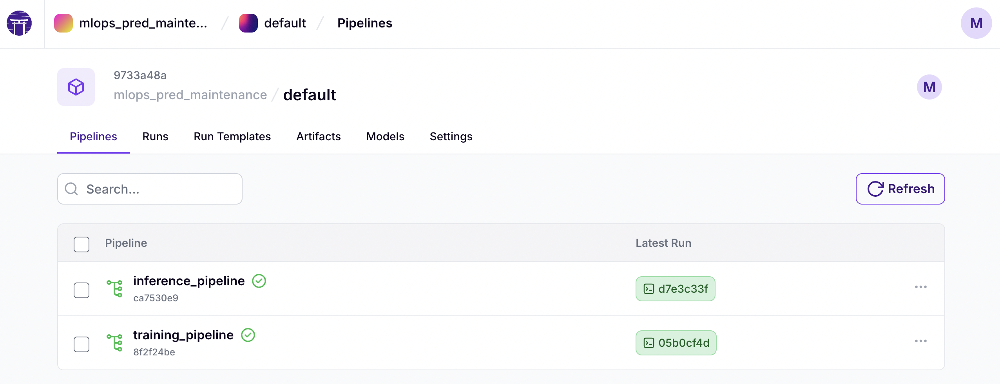
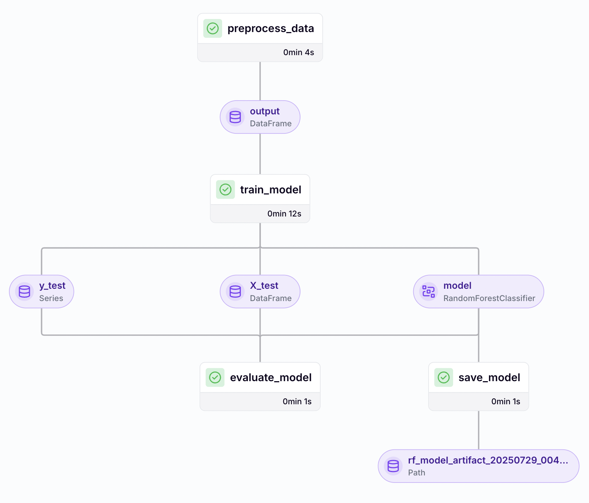
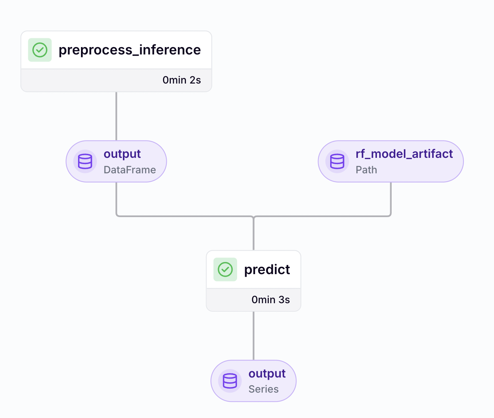

## About the model

A Random Forest model is trained using sensor readings (volt, rotate, pressure, vibration), processed with 3-hour rolling windows to compute mean and standard deviation per machine. Machine metadata like model and age is added, and categorical columns are one-hot encoded.

The model uses binary classification, where each data point is labeled 1 if a failure occurs within the next 24 hours, and 0 otherwise. 

> This approach is based on the solution presented in the following Kaggle notebook:  
> [Predictive Maintenance - ANAI by d4rklucif3r](https://www.kaggle.com/code/d4rklucif3r/predictive-maintenance-anai)

---
## ML pipeline automation

The pipelines in this project were built using ZenML, an MLOps orchestration platform that simplifies building, running, and versioning machine learning workflows.

ZenML makes it easy to define steps like preprocessing, training, evaluation, model registration, and inference within a clean and modular structure. Its web interface allows users to explore pipeline runs, review saved artifacts, and track model versions over time.

🔗 [ZenML Pipelines Dashboard](https://mmfercoria-mlops-predictive-maintenance.hf.space/projects/default/pipelines)

### Training

#### Steps:

1. **`preprocess_data`**:  
   - Loads telemetry and failure data
   - Calculates rolling 3-hour features
   - Assigns binary label (1 if failure occurs within 24h, else 0)
   - One-hot encodes machine model

2. **`train_model`**:  
   - Trains a RandomForestClassifier using preprocessed data
   - Splits the data into training and test sets

3. **`evaluate_model`**:  
   - Evaluates model performance using metrics like AUC, confusion matrix, etc
   - Saves results in a JSON file

4. **`save_model`**:  
   - Saves the trained model in the ZenML artifact store

### Inference

#### Steps:

1. **`preprocess_inference`**:  
    - Loads telemetry data for prediction
    - Computes rolling 3-hour features
    - Merges machine metadata and encodes model

2. **`predict`**:  
    - Loads the latest saved model
    - Runs predictions on the new data
---
### Lineage and Traceability

ZenML automatically tracks the full lineage of each pipeline run, including the steps executed, parameters used, models, and artifacts generated. This allows for complete reproducibility, making it easy to trace back the origin of models, compare versions, audit experiments, and understand how each output was produced throughout the ML lifecycle.

---
### Deployment and Usage

The model is designed to be deployed in a batch inference setup, where new data is processed at scheduled time intervals. Instead of making predictions in real time, the pipeline runs periodically .

The inference pipeline built with ZenML can be scheduled. This allows predictions to be generated automatically without manual intervention, ensuring consistency, traceability, and efficiency in predictive maintenance operations.

---
### Implementation Notes

While the current code works and enables predictions and visualization, this implementation still has some important limitations. It is not yet connected to a cloud server or automatic data source, so it is not scalable or production-ready. To make it more robust and maintainable, future improvements could include:

- **Ensure a stable execution environment**  
  Where the system can operate reliably with the necessary computing resources
- **Deploy the solution to a cloud infrastructure**  
  Platforms like GCP, AWS, or Azure support auto-scaling, updates, and continuous maintenance
- **Set up a cloud-based storage system**  
  To provide continuous access to both historical and real-time data that feeds the inference and training pipelines